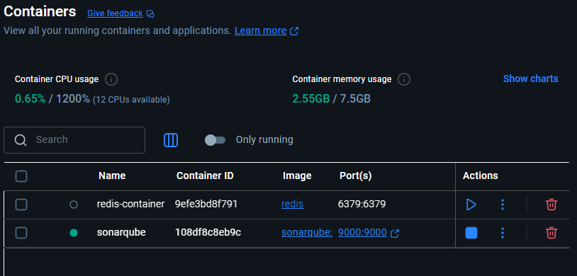
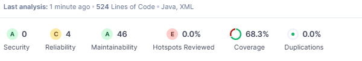
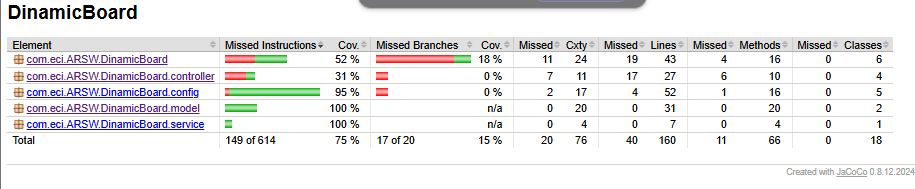

# DinamicBoard

DinamicBoard is an interactive, dynamic, and multi-user web application that allows you to manage strokes on a digital board.

## Technologies

- Java 17
- Spring Boot 3.5.3
- Maven

## Installation

1. Clone the repository:

   ```bash
   git clone https://github.com/your-username/DinamicBoard.git
   cd DinamicBoard
   ```
## Build and run the application:

  ```bash
  mvn spring-boot:run
  ```

## API Endpoints

* GET /strokes
  
  Retrieves the list of current strokes
  
* POST /strokes
  
  adds a new stroke.

  JSON Body:
  ```json
  {
    "x": 10.5,
    "y": 20.0,
    "color": "#FF0000"
  }  
  ```
* DELETE /strokes
  
Deletes all strokes.

## Configuration
you can change the port and application name in src/main/resources/application.properties.


## SonarQube implementation

### SonarQube container working on docker



### plugins needs to be added in pom.xml

```xml
<plugins>
			<!-- Spring Boot Plugin -->
			<plugin>
				<groupId>org.springframework.boot</groupId>
				<artifactId>spring-boot-maven-plugin</artifactId>
			</plugin>

			<!-- JaCoCo Plugin -->
			<plugin>
				<groupId>org.jacoco</groupId>
				<artifactId>jacoco-maven-plugin</artifactId>
				<version>0.8.12</version>
				<executions>
					<execution>
						<goals>
							<goal>prepare-agent</goal>
						</goals>
					</execution>
					<execution>
						<id>report</id>
						<phase>test</phase>
						<goals>
							<goal>report</goal>
						</goals>
						<configuration>
							<excludes>
								<exclude>**/configurators/**</exclude>
							</excludes>
						</configuration>
					</execution>
					<execution>
						<id>jacoco-check</id>
						<goals>
							<goal>check</goal>
						</goals>
						<configuration>
							<rules>
								<rule>
									<element>PACKAGE</element>
									<limits>
										<limit>
											<counter>CLASS</counter>
											<value>COVEREDRATIO</value>
											<minimum>0</minimum>
										</limit>
									</limits>
								</rule>
							</rules>
						</configuration>
					</execution>
				</executions>
			</plugin>

			<!-- SonarQube Plugin -->
			<plugin>
				<groupId>org.sonarsource.scanner.maven</groupId>
				<artifactId>sonar-maven-plugin</artifactId>
				<version>4.0.0.4121</version>
			</plugin>
		</plugins>
```

### Results

#### SonarQube results



#### JaCoCo results


